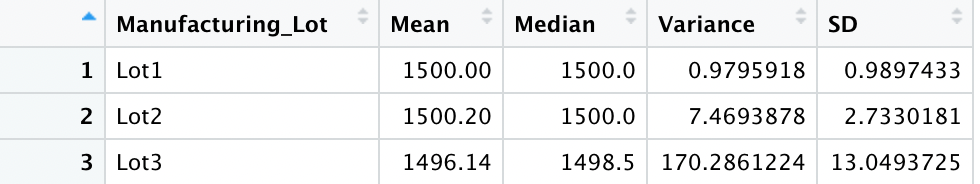
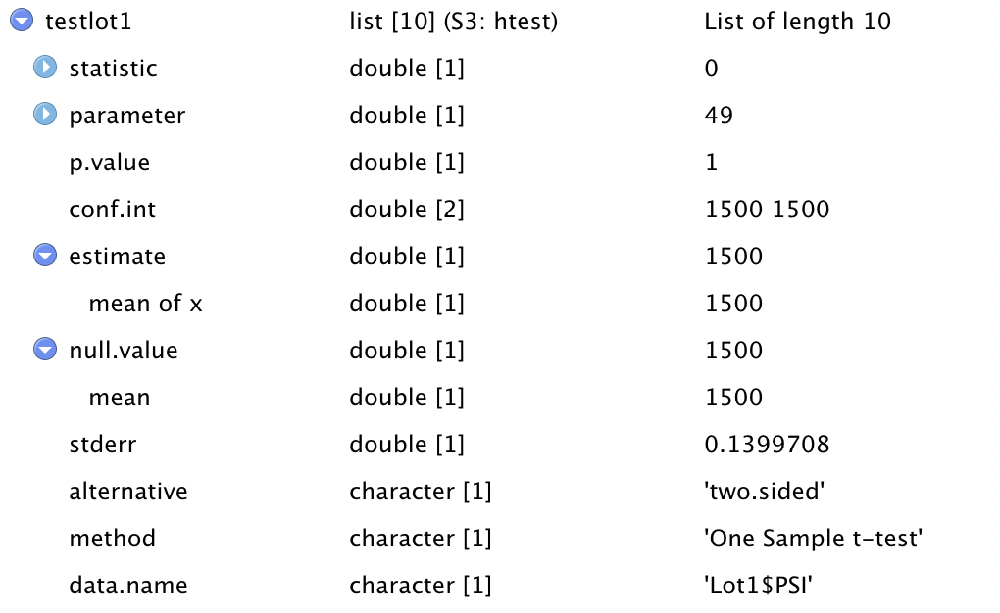
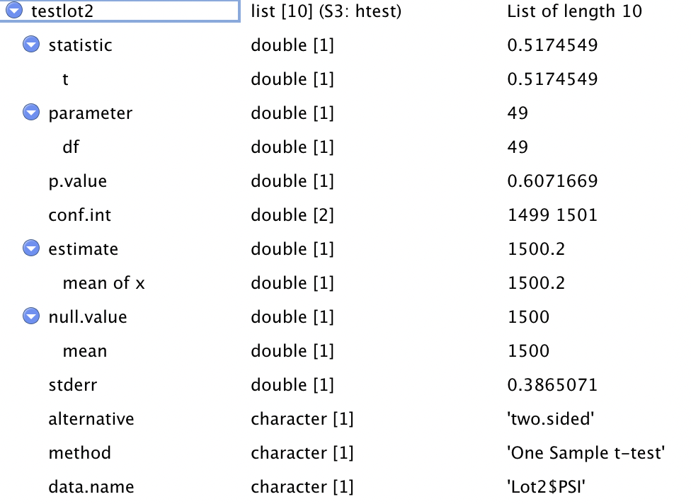
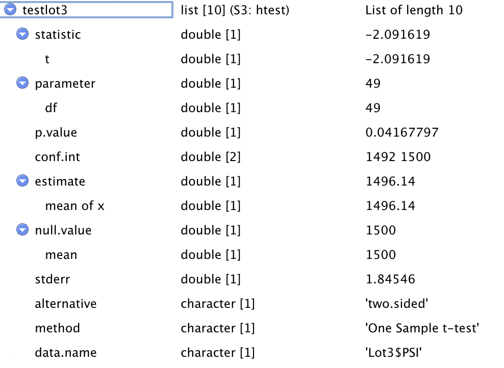

# MechaCar_Statistical_Analysis
## Linear Regression to Predict MPG
Which variables/coefficients provided a non-random amount of variance to the mpg values in the dataset?

1- vehicle length
2- ground_clearance

Is the slope of the linear model considered to be zero? Why or why not?

The slope of the linear model is zero because as the mpg increases the other variables increase.

Does this linear model predict mpg of MechaCar prototypes effectively? Why or why not?

Yes, because over 70% of the data has a confirmed relationship, meaning it is not due to chance.

## Summary Statistics on Suspension Coils
The design specifications for the MechaCar suspension coils dictate that the variance of the suspension coils must not exceed 100 pounds per square inch. Does the current manufacturing data meet this design specification for all manufacturing lots in total and each lot individually? Why or why not?

The data does not meet this specification because lot 3 is above 100 of variance. 

## T-Tests on Suspension Coils
According to the T-tests conducted on each of the lots, none were significantly different from the population mean of 1500. 

## Study Design: MechaCar vs Competition

Write a short description of a statistical study that can quantify how the MechaCar performs against the competition. In your study design, think critically about what metrics would be of interest to a consumer: for a few examples, cost, city or highway fuel efficiency, horse power, maintenance cost, or safety rating.

In your description, address the following questions:
What metric or metrics are you going to test?
What is the null hypothesis or alternative hypothesis?
What statistical test would you use to test the hypothesis? And why?
What data is needed to run the statistical test?
